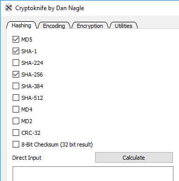
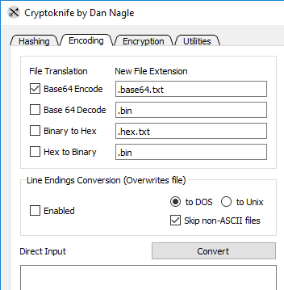
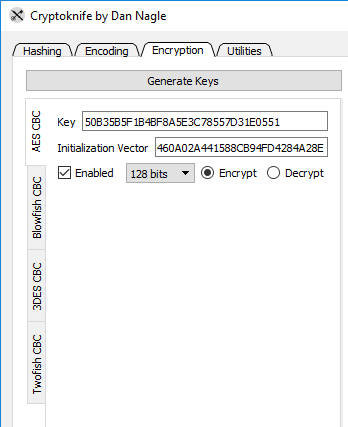
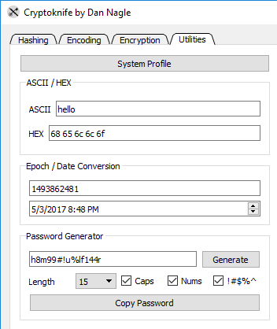

# Cryptoknife
  

Cryptoknife is an open source portable utility to allow hashing, encoding, and encryption through a simple drag-and-drop interface. It also comes with a collection of miscellaneous tools. The mainline branch officially supports Windows and Mac. Cryptoknife is free and licensed GPL v2 or later. It can be used for both commercial and personal use.

Cryptoknife works by checking boxes for the calculations and then dragging files to run the calculation. Cryptoknife performs the work from every checked box on *every tab* and displays the output the log and saves to a log file. By default, very common hashing boxes are pre-checked.

## Support

* Twitter: [@NagleCode](http://twitter.com/naglecode)
* You may also track this project on [GitHub](http://github.com/dannagle/Cryptoknife).
* Secure Anonymous Email: [Contact me](https://cryptoknife.com/contact)

## Settings and Log
for Windows, the settings are saved as `cryptoknife_settings.ini` inside the run-time directory. The log file is `cryptoknife.log` is also in the run-time directory.

For Mac, settings are saved in `Library/Application Support/com.cryptoknife/cryptoknife_settings.ini`. The log file is `cryptoknife.log` and is saved in your `Downloads` directory.

Settings are saved when the app exits. The log is saved whenever the console is updated.

### Hashing
Simply check the boxes for the algorithms to use, and then drag-and-drop your directory or file.

* MD5, MD4, MD2
* SHA-1, 224, 256, 384, 256
* CRC-32
* Checksum

There is also direct input available. Cryptoknife will perform all hashing algorithms on direct input.

### Encoding
Except for line-ending conversion, Cryptoknife appends a new file extension when performing its work. However, it is still very easy to drag-and-drop and encoder/encrypt thousands of files. With great power comes great responsibility.

  * Base64
  * HEX/Binary
  * DOS/Unix EOL

There is also direct input available. Results are displayed (which may not be viewable for binary results).

### Encryption
All the encryption algorithms use CBC mode. You may supply your own Key/IV or generate a new one. Note that if you change the bit-level, you need to re-click "Generate" since different bits require different lengths.

  * AES/Rijndael CBC
  * Blowfish CBC
  * Triple DES CBC
  * Twofish CBC

### Utilities
System profile gives a listing of RAM, processor, attached drives, and IP addresses. It is also ran on start-up. ASCII/HEX is the same conversion interface used by Packet Sender. Epoch/Date is a very common calculation used in development. Password Generator has various knobs to create a secure password.

  * System Profile
  * ASCII/HEX
  * Epoch/Date convert
  * Password Generator

Using Cryptoknife, an open-source utility which generates no network traffic, is a very safe way to generate a password.

### Building
Cryptoknife uses these libraries.
* https://www.cryptopp.com/
* https://www.qt.io/download-open-source/

All the project files are statically-linked to create a single executable in Windows. Mac uses dynamic linking since apps are just directories.

## Sponsorships
Would you like your name or brand listed on this website? Please <a href="/contact">contact me</a> for sponsorship opportunities.

## License
GPL v2 or Later. [Contact me](https://cryptoknife.com/contact) if you require a different license.

## Copyright

Cryptoknife is wholly owned and copyright &copy;  -  [@NagleCode](http://twitter.com/NagleCode) - [DanNagle.com](http://DanNagle.com)  -  [Cryptoknife.com](https://cryptoknife.com)
